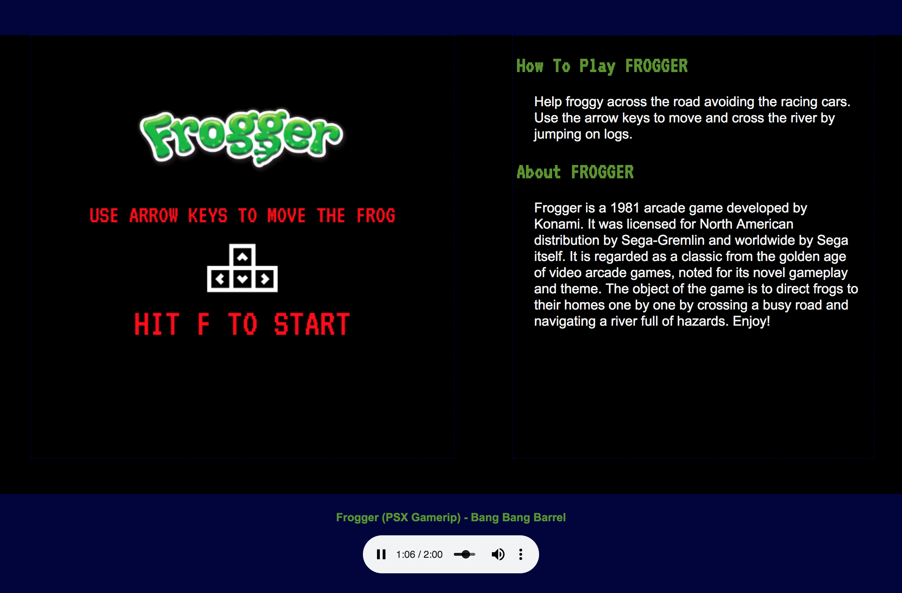
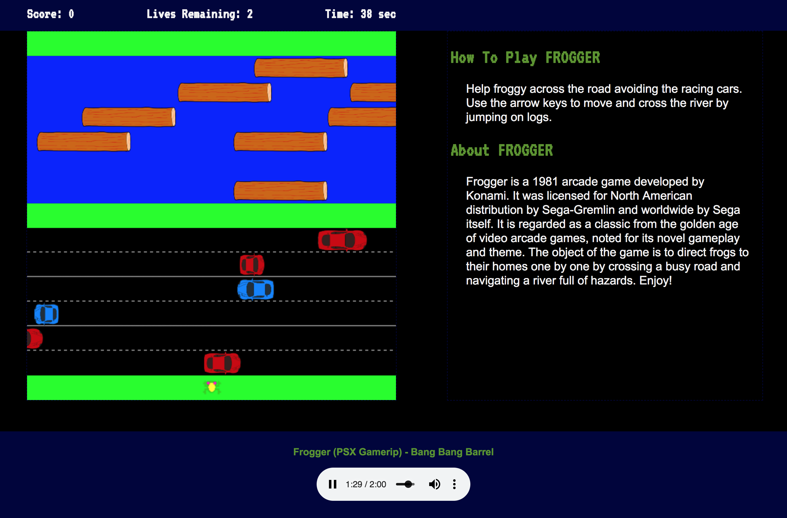

# Game Time - Frogger

Recreation of Frogger, a 1980's arcade game, using HTML Canvas and JavaScript. 

## Goals

* Use OOP to drive the design of the game and the code
* Separate business-logic code from view-related code
* Create a robust test suite that thoroughly tests all functionality of a client-side application

## Result

